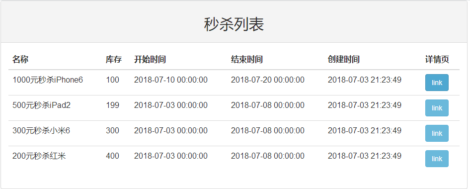

# SSM 实现高并发秒杀 API 业务

## 项目内容

- SSM 使用与整合
- 秒杀类系统需求理解和实现
- 常用技术解决高并发问题

## 实现哪些秒杀功能

- 秒杀接口暴露
- 执行秒杀
- 相关查询

## 界面

展示秒杀列表

用户点击其中一个商品，进行秒杀。如果还没有到秒杀时间，就显示倒计时

如果可以秒杀，就显示一个按钮，让用户点击执行秒杀操作

如果秒杀已结束，告知用户

## 秒杀详情页流程逻辑

1. 获取标准系统时间
2. 时间判断
   - 开始时间 => 未开始 => 倒计时
   - 结束时间 => 结束 => 秒杀结束
3. 获取秒杀接口
4. 执行秒杀
5. 得到结果

## Restful 接口

- GET /seckill/list 秒杀列表
- GET /seckill/{id}/detail 详情页
- GET /seckill/time/now 系统时间
- POST /seckill/{id}/expose 暴露秒杀接口
- POST /seckill/{id}/{md5}/execution 执行秒杀

## 相关技术介绍

- MySQL
  - 表设计
  - SQL 技巧
  - 事务和行级锁
- MyBatis
  - DAO 层设计与开发
  - MyBatis 的合理使用
  - MyBatis 与 Spring 的整合
- Spring
  - Spring IOC 整合 Service
  - 声明式事务的运用
- SpringMVC
  - RESTFul 接口设计和使用
  - 框架运作流程
  - Controller 开发技巧
- 前端
  - 交互设计
  - Bootstrap
  - JQuery
    - jquery-cookie Cookie管理插件
    - jquery.countdown 倒计时插件
- 高并发
  - 高并发点和高并发分析
  - 优化思路并实现

## 秒杀业务分析

下图是秒杀系统业务流程

可以看到，业务流程中设计到三个角色：商家、库存、用户。商家和用户执行的一系列操作都是对库存的增减。所以，库存就是系统的业务核心。

## 数据落地

商家和用户对库存的操作，比如减少库存、记录购买明细，这些都需要记录到数据库中，也就是数据落地。如何正确地把数据存入到数据库中，这就要涉及到“事务”的概念。因为事务可以保证数据的正确性。

## 秒杀难点分析

秒杀的特点在于，大量用户对商品进行抢购，也就是说同一个商品会有很多个用户进行竞争。如果是热点商品，竞争会更激烈。所以秒杀的难点就是**如何高效地处理竞争**。

## 高并发点和瓶颈分析

高并发出现在两个点：

1. 获取秒杀详情
2. 执行秒杀操作

### 1. 获取秒杀详情

获取秒杀详情，需要查询数据库，获取该商品的秒杀详情，比如开始时间、结束时间、库存等信息，对数据库的压力还是挺大的。

### 1.1 后端缓存

可以使用后端缓存，比如 Redis，把商品的秒杀详情数据放到 Redis 中。当用户请求秒杀详情的时候，首先从缓存中获取，如果没有数据再从 MySQL 中获取，这样就能提高响应速度。

对于数据的存储，可以使用使用序列化，在把数据存储到 Redis。对于序列化技术，推荐使用 ProtocolBuffer。有一份[文档](https://github.com/eishay/jvm-serializers/wiki)，可以看出 ProtocolBuffer 的性能很高。

### 2. 执行秒杀操作

在执行秒杀操作的时候，需要开启事务，执行减库存和记录明细的操作。

开启事务，获取行级锁，然后进行减库存和记录明细，在这个过程中需要发送 SQL 语句到 MySQL 执行，涉及到网络延迟。同时在执行 SQL 的过程中，还有可能触发 Java 的 GC，最后再执行事务的 commit 或者 rollback。

当事务执行完毕，释放了行级锁之后，才能让第二个在等待的请求去执行事务

## 2.1 事务简单优化

我们可以把记录明细放在减库存之前执行，这样就能减少行级锁的锁定时间

## 2.2 事务深度优化

有一个测试，1 秒时间内，MySQL 可以对同一行执行 4 万次 update 的操作，效率非常高。

我们目前事务的操作是通过 Java 代码发送 SQL 语句到 MySQL 去执行的，如果把事务 SQL 放到 MySQL 上用存储过程来执行，可以减少事务行级锁持有的时间，加快执行速度。

经过测试，一个秒杀商品，使用存储过程可以扛住 6000 QPS，已经很高了。

## 优化总结

1. 前端控制：暴露接口，按钮防重复点击
2. 动静态数据分离：CDN 缓存，后端缓存
3. 事务竞争优化：减少事务锁的时间

## 大型系统部署架构

### 系统可能用到哪些技术？

- CDN
- WebServer：Nginx + Jetty
- Redis
- MySQL

### 部署的架构是什么样的？

### 可能参与的角色

- 开发：前端 + 后端
- 测试
- DBA
- 运维